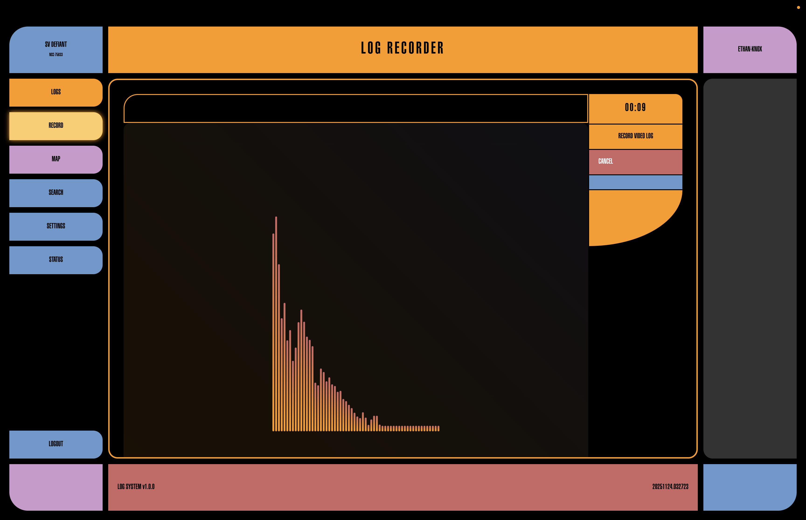
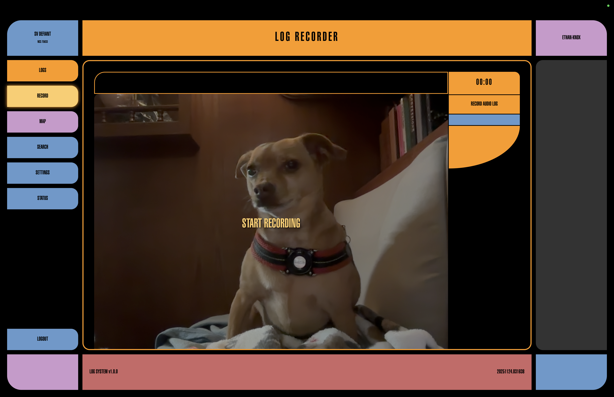
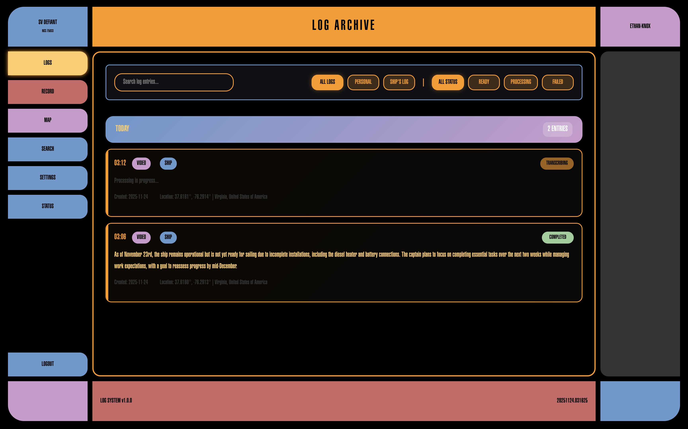
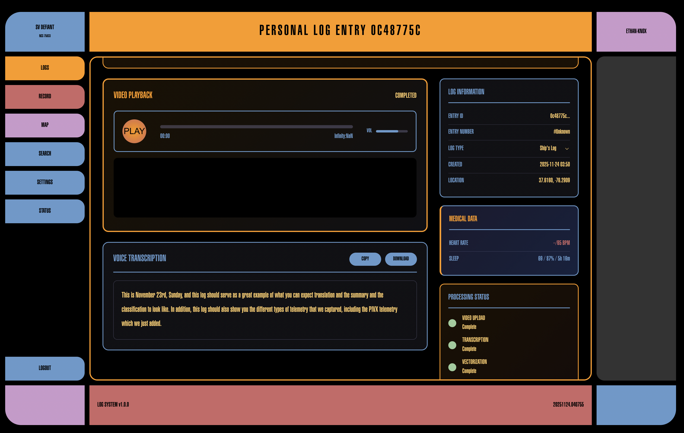
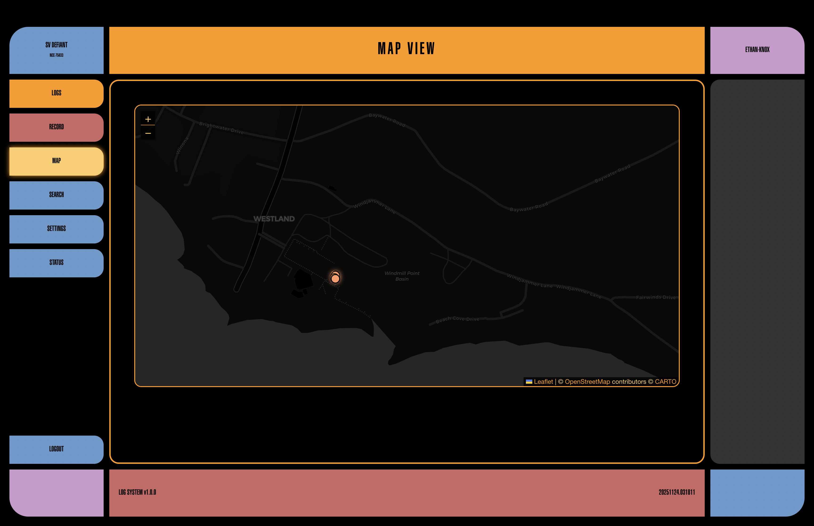
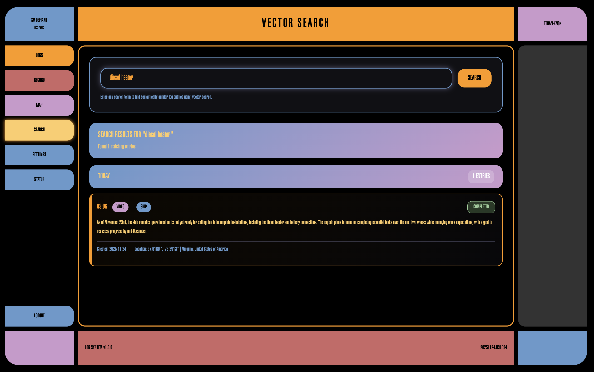
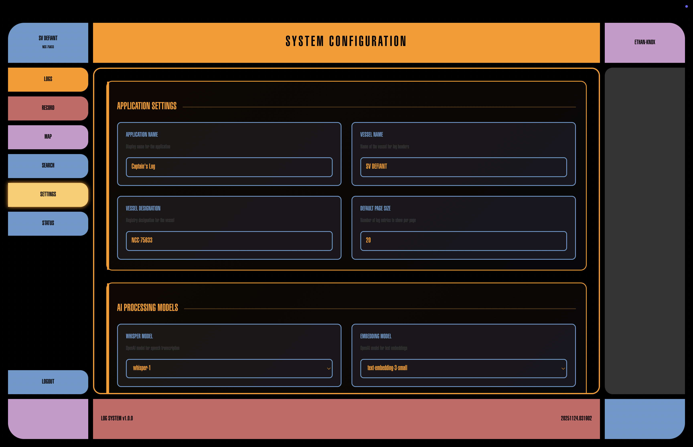
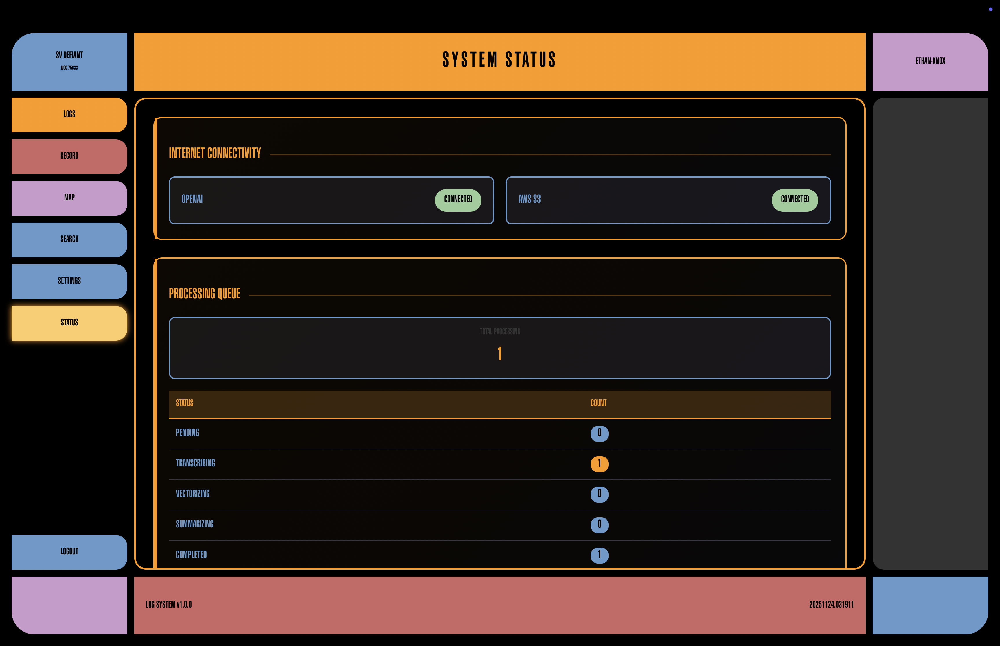

# Captain's Log

All ships need to keep a log, both Starships and Sailing Vessels alike. This library allows you to and your crew to keep robust, detailed logs of your voyages and adventures.


## Recording Logs

The core functionality of this library is to record logs. Crew can record either personal or ship's logs (designate which type by starting your log with "Personal Log" or a crew position like "First Mate's Log" and the library will correctly label the log). Ship's logs are considered canonical vessel records and are available to read and review by all of the crew. Personal logs are restricted to the user recording the log.

Log recordings come in two flavors:

**Audio Recordings:**


The primary interface for recording logs is audio recording.

**Video Recordings:**

You can also record video and it is stored and processed in exactly the same way as the audio.

**Transcription**

Once your log is recorded it will be processed. This processing includes:
- transcription to a text log
- summarization to a quick to read, episode-like description
- vectorization for related searching

## Telemetry

Good logs provide context, the more the better. By default `Captain's Log` captures the following data at the time of log recording:
**Always Captured**
- Date & time
- Geolocation data (latitude/longitude, nearest city, nearest port/body of water)
- Weather data:
    - Natural Language Conditions (ie "cloudy")
    - Air Temp
    - Wind Speed
    - Visibility
    - Humidity
    - 46.0°F

**Optional**
- fitbit: if a crew member pairs a fitbit device to their account (option is in settings), `Captain's Log` will capture health data from that user and display it in the "medical" card on log detail pages. What data is available will vary based on device, but can include:
    - current/resting heartrate
    - blood o2
    - sleep score
    - sleep hours
    - activity score
    - cals burned that day

## Storage
Since most of us are not stowing 10TB of extra disk onboard, `Captain's Log` is designed to use S3 as the primary storage backend for the original log video/audio files. You can optionally configure local storage.

As internet is not a constant on the open water (or in the Gamma Quadrant) `Captain's Log` uses a durable eventually-consistent retry strategy; while connection is lost, logs are held in local storage and can be played in the detail page. As soon as you connect again, logs are moved to S3, transcribed and instrumented, and the local cache is purged.

## Additional Features

### Map View

As your crew records logs, your voyage is charted automatically. This makes it easy to find a specific log (and it looks super cool displayed on your wall).

### Semantic Search

You can search not just for text but related phrases, like "seasick" and "Romulans"

### Settings

All settings can be set either by envars or in the settings panel, making it easy to configure your system without needing shell access.

### Status Page

When internet is flakey (like on a boat at sea) it helps to know if you have connection. This also lets you manually restart any processing jobs that have been "stuck" for long periods without a connection for them to complete.

## Auth
Initial auth must be done using user/password for at least one crew member. That crew member may then go into settings and enable SSO for any of:
- github
- facebook
- google

To secure your `Captain's Log`, set `allow_new_user_registration` to `False` and the "sign up" routes will be disabled.

## Installation
The easiest way to get started right now is the docker compose
```bash
git clone git@github.com:norton120/captains_log.git &&\
cd captains_log &&\
docker compose up -d &&\
open captains-log.locahost:8082
```
But a cleaner solution is coming soon, I promise!

## Where are we boldy going next?
1. **Signal K integration**: the holy grail, allowing a much wider and more dynamic range of ship's data to be attached to the logs.
2. **Granular Log Type Parsing**: it would be great to tag logs by the rank/role of the recorder and search by that later.
3. **Code Cleanup**: lots and lots of de-vibing and refactoring is overdue.